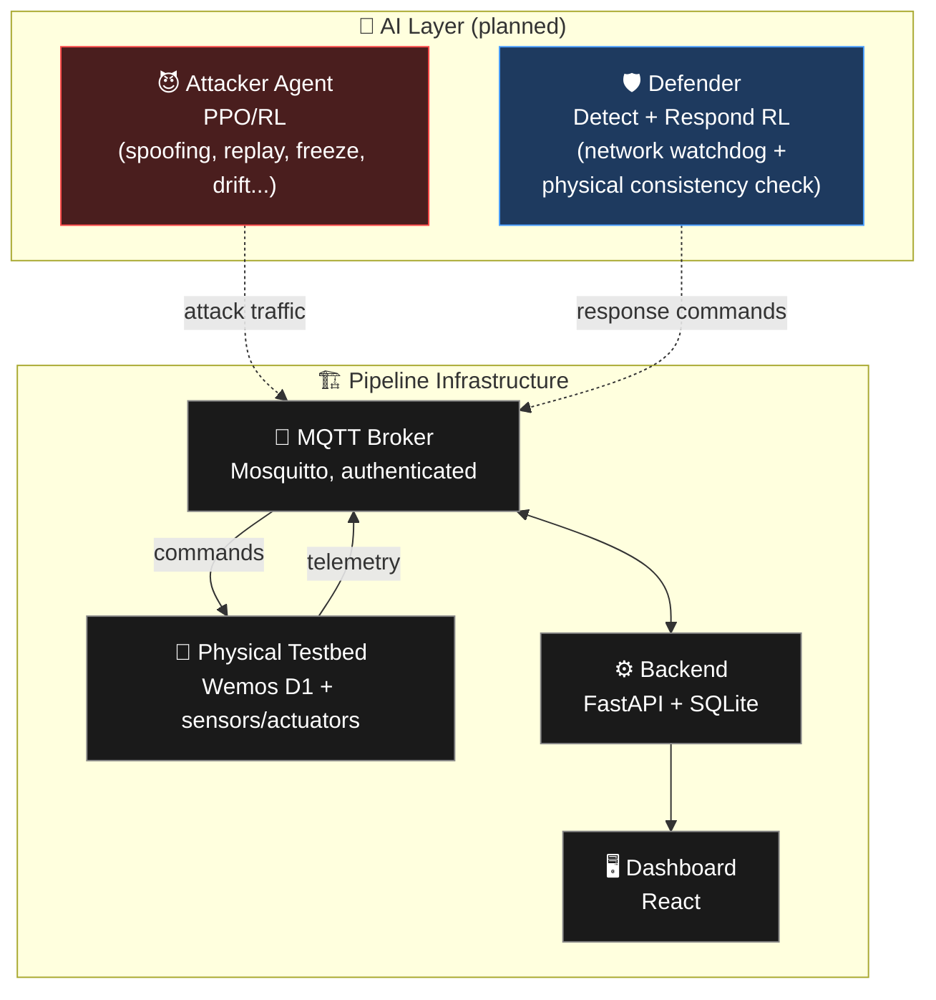

<div align="center">

# 🏢 AI vs AI — Co-Evolving AI Agents for Cyber-Physical Defense of Smart Buildings

### A real hardware testbed where an attacker AI and a defender AI continuously adapt to each other.

[](https://www.python.org/)
[](https://fastapi.tiangolo.com/)
[](https://react.dev/)
[](https://mosquitto.org/)
[](https://www.docker.com/)
[](LICENSE)

</div>

---

## 📖 Overview

**Hisn** (SE499 — Prince Sultan University) is a senior project that builds a real smart-building IoT testbed where an **attacker agent** and a **defender agent** co-evolve against each other. Unlike most cyber-physical security research that stops at simulation, every attack here can trigger **measurable physical effects** on real hardware — a locked door actually unlocking, a fan actually turning on, a sensor actually reporting a fake reading.

> **Core claim:** a defender trained through co-evolution against an adaptive attacker generalizes to unseen attacks better than a defender trained on static attack patterns — validated on real hardware, not simulation alone.

---

## 🏗️ Architecture



> **Note:** the Attacker and Defender agents are design-stage components at this point in the project. Per the pipeline-first principle, the hardware → MQTT → backend → dashboard pipeline is built and secured first; the AI layers above connect into it once infrastructure is validated.

An **emulator** container stands in for any component not yet wired up in hardware, publishing to the same topics with the same payload shape — nothing downstream needs to change when real hardware comes online.

---

## 🔩 Hardware Components

| Component | ID | Type | Role |
|---|---|---|---|
| 🌡️ DHT22 | `temp_1` | Sensor | Temperature / humidity |
| 🚶 PIR | `motion_1` | Sensor | Motion detection |
| 🔒 Servo lock | `lock_1` | Actuator | Door lock/unlock |
| 🌀 Fan (relay) | `fan_1` | Actuator | Fan on/off |
| 🔘 Push button | `button_1` | Sensor | Manual trigger |

Board: **Wemos D1 (ESP8266)** · Firmware: Arduino (`firmware/`)

---

## 🚀 Setup

### 1. Environment variables
```bash
copy .env.example .env      # Windows
cp .env.example .env        # macOS / Linux
```
Open `.env` and set real values for `MQTT_USERNAME` and `MQTT_PASSWORD`.

### 2. MQTT broker credentials
The broker requires authentication (`allow_anonymous false`). Generate its password file — **not committed to git**:
```bash
docker run --rm -v "${PWD}/broker:/mosquitto/config" eclipse-mosquitto:2 sh -c "mosquitto_passwd -c -b /mosquitto/config/passwordfile <username> <password> && chmod 644 /mosquitto/config/passwordfile"
```
Use the same username/password as step 1. If `broker/passwordfile` already exists, delete it first (`mosquitto_passwd -c` won't overwrite).

### 3. Launch the stack
```bash
docker compose up --build
```

| Service | URL |
|---|---|
| 🖥️ Dashboard | http://localhost:5173 |
| ⚙️ Backend API | http://localhost:8000 |
| ❤️ Health check | http://localhost:8000/health |

### 4. Real hardware
```bash
copy firmware\config.h.example firmware\config.h   # Windows
```
Fill in your real Wi-Fi and MQTT credentials (must match `.env`), then flash to the board via Arduino IDE.

> ⚠️ Real hardware currently covers all 5 components, so the emulator is fully excluded in `docker-compose.yml`:
> ```bash
> EXCLUDE_COMPONENTS: "temp_1,motion_1,lock_1,fan_1,button_1"
> ```
> If a component's hardware ever goes offline and you need the emulator to fill in for just that one, override at runtime, e.g.:
> ```bash
> EXCLUDE_COMPONENTS=motion_1,lock_1,fan_1,button_1 docker compose up emulator
> ```
> (excluding everything except `temp_1`, so only the DHT22 gets emulated while the rest stay on real hardware)

---

## 📊 Datasets

### Original (public) datasets

| Dataset | Used for | Source |
|---|---|---|
| CICIoT2023 | IoT attack traffic (network layer) | [UNB CIC IoT Dataset 2023](https://www.unb.ca/cic/datasets/iotdataset-2023.html) |
| CASAS | Smart-home motion/door/temperature sensor data | [CASAS Datasets — WSU](https://casas.wsu.edu/datasets/) |
| TON_IoT | IoT/IIoT telemetry + network intrusion data | [TON_IoT Datasets — UNSW Research](https://research.unsw.edu.au/projects/toniot-datasets) |
| Ghost in the Building | Non-invasive spoofing / covert attacks on automated buildings | [ScienceDirect paper](https://www.sciencedirect.com/science/article/pii/S2666281725000198) *(verify before publishing)* |
| Bristol | Multi-sensor, multi-device smart building indoor environmental data (6 months, 8 IoT devices — temp, humidity, pressure, gas, light, accelerometer) | [University of Bristol Data Repository](https://data.bris.ac.uk/data/dataset/fwlmb11wni392kodtyljkw4n2) |

### Cleaned datasets

Cleaned and preprocessed versions (`ciciot2023_filtered_clean.csv`, CASAS balanced/unbalanced subsets, Ghost in the Building baseline + flagged-window files) are stored in the team's shared Google Drive:

🔗 **[Cleaned datasets — Google Drive](https://drive.google.com/drive/folders/10eRLsFsIraQ7FwunxqSjagztOTh8uccY?usp=drive_link)**

> Real hardware episodes are reserved for validation, not bulk training (a few hundred to ~1,400 episodes over the project). These public datasets carry the training volume. Real and synthetic samples are tagged separately and never blended in reported numbers.

---

## 🔐 Security

- MQTT broker requires authentication — anonymous connections are rejected
- Credentials never committed: `.env`, `broker/passwordfile`, and `firmware/config.h` are all git-ignored
- Backend validates every incoming reading against a strict per-component schema before it touches the database

---

## 🧪 Testing

Test cases, results, and known issues are documented per sprint — see the sprint documentation for full test tables and the bug tracker for open items.

---

## 👥 Team

| Member | Role |
|---|---|
| Deem | AI/Team Lead — Attacker Agent & Defender Response Layer & hardware setup|
| Mariam | AI — Defender/Detect Model & Defender Response Layer |
| Lama | Cybersecurity — Attack Research & Hardware |
| Sarah | Cybersecurity — Hardware, MQTT |
| Zaina | Hybrid — Backend, Dashboard, Documentation |


---

## 📄 License

MIT — see [LICENSE](LICENSE)

<div align="center">

*Prince Sultan University · College of Computer & Information Sciences · SE499*

</div>
